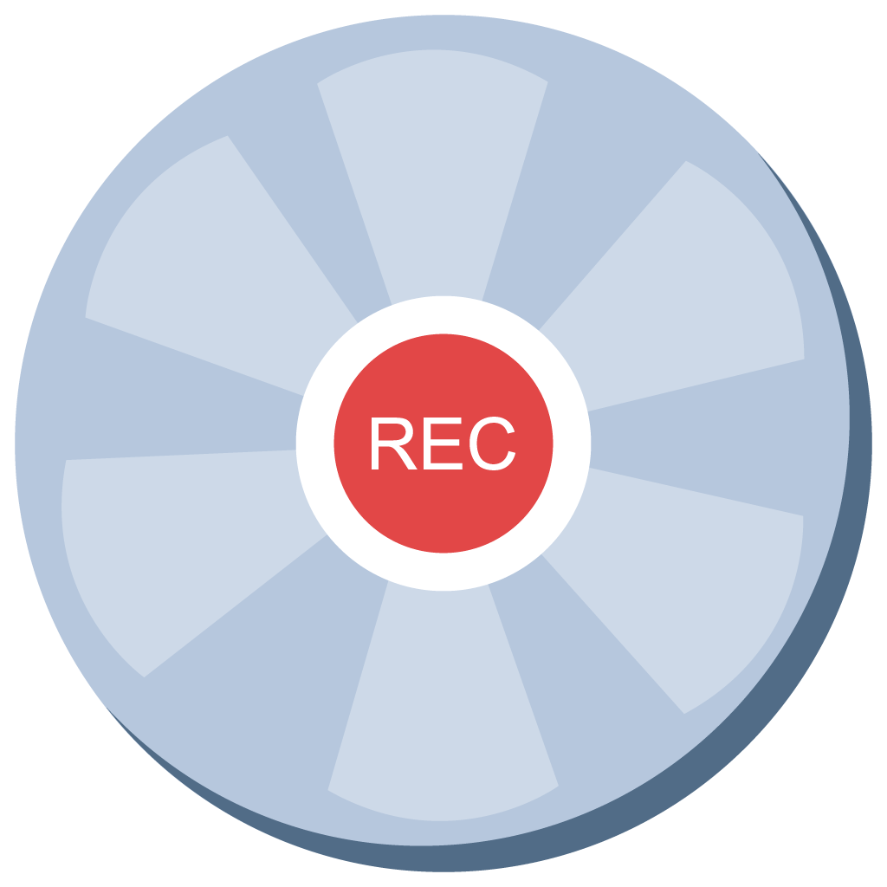
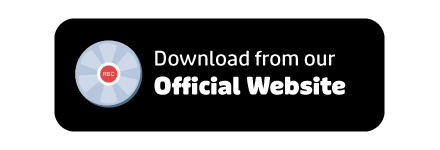
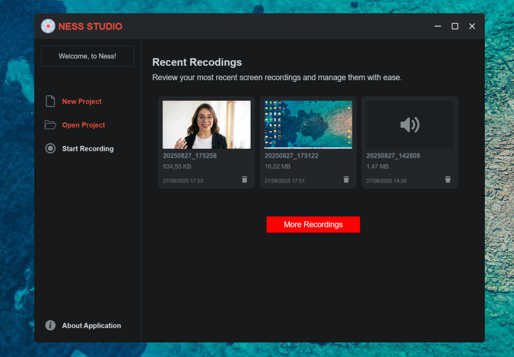
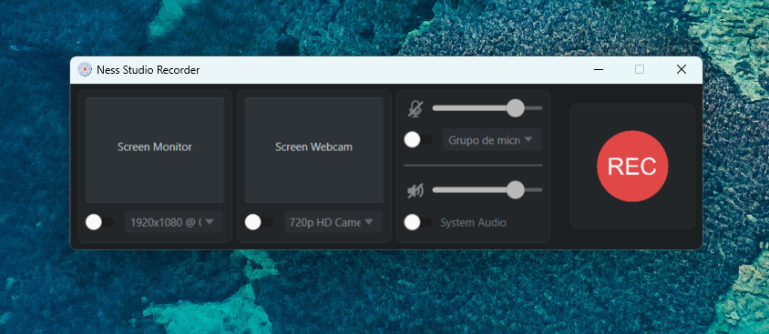
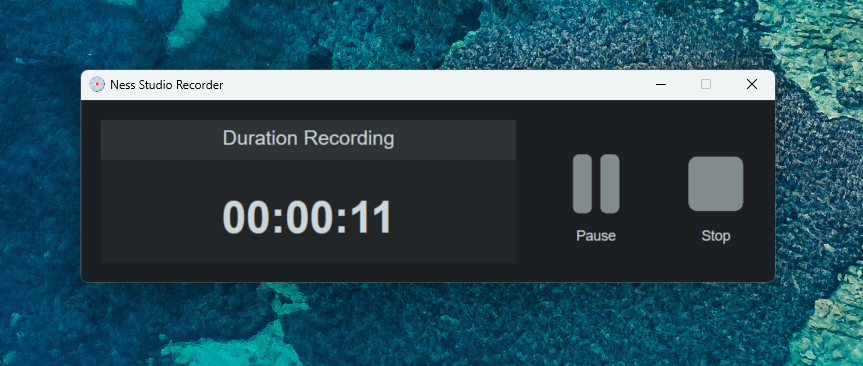

  

<h1 align="center">
  NessStudio For Windows (1.0.0)
</h1>

  Capture everything in high quality :)

  

# NessStudio

**NessStudio** is an application made for Windows (10/11) capable of recording your screen, webcam, and audio (microphone + system) in MP4/WAV. This type of application is ideal for tutorials, classes, onboarding, technical support and quick everyday recordings.

See the benefits of using **NessStudio**:

- **Capture modes:** entire monitor or _Draw Area_ (custom region).
- **Webcam + Screen:** perform simultaneous recordings with configurable quality.
- **Full Audio Support:** record your microphone and system audio outputs to a .WAV track.
- **Pause or Resume:** pause your recordings and resume them whenever you want.
- **Ready files:** MP4 with _faststart_ (streaming-friendly) and folders per session.
- **Light and straightforward:** simple interface, countdown timer, no distractions.

## Application Images

  

    
  

  

    
  

  

    
  

## How to runs this application locally?

This application was made using the following technologies:

- C#
- Windows Presentation Foundation (WPF)
- SQLite

In conjunction with the following libraries:

- [FFMpeg](https://ffmpeg.org/)
- [MaterialDesignThemes](https://github.com/MaterialDesignInXAML/MaterialDesignInXamlToolkit)

To run this application on your local machine, make sure you have the latest version of **Visual Studio Community 2022**.

First of all, **clone the repository to your local machine**, and then simply open the **NessStudio.sln** file to open the project.

Don't forget to download the **FFMpeg executables** (_ffmpeg.exe, ffplay.exe, ffprobe.exe_) and place them inside the _Modules_ folder.

## Contribuite

Want to create new features for **NessStudio**? Then make sure you create a new feature (or a new translation file) and submit a new **Pull Request** (PR).

Feel free to open new **Pull Requests** (PR) whenever you create new bug fixes or future translations.

---

## License

This script is open-source and available under the MIT License.
