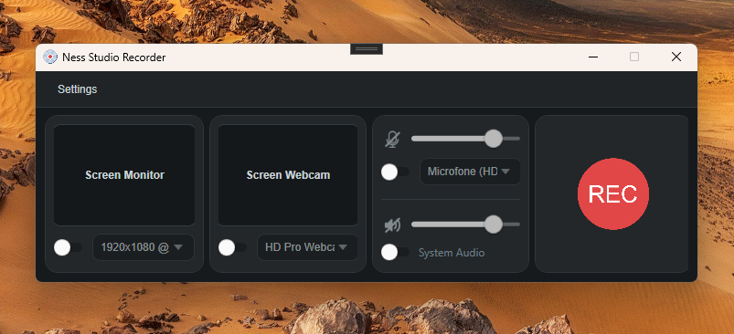
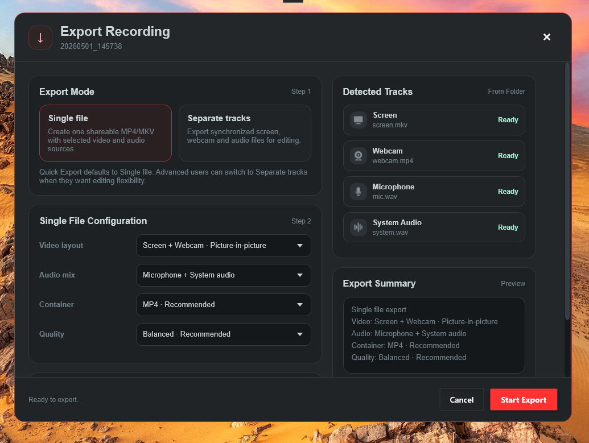

<p align="center">
  
</p>

<h1 align="center">
  NessStudio For Windows (2.0.0 Beta)
</h1>

<p align="center">
  Capture everything in high quality :)
</p>

<p align="center">
  <a href="https://micilini.com/apps/nessstudio" target="_blank">
    
  </a>
</p>

[](https://dotnet.microsoft.com/)
[](https://www.microsoft.com/windows)
[](https://learn.microsoft.com/en-us/dotnet/desktop/wpf/)
[](https://learn.microsoft.com/en-us/uwp/api/windows.graphics.capture)
[](https://github.com/micilini/NessMuxer)
[](https://ffmpeg.org/)
[](https://github.com/micilini/NessStudio/blob/main/LICENSE)
[](https://github.com/micilini/NessStudio/releases)
[]()

---

> ⚠️ **Public Beta**
>
> NessStudio 2.0.0 is a major architecture update. The current generation is focused on native screen capture, independent recording tracks, reliable session metadata, recording previews, and FFmpeg-based export workflows.

---

# NessStudio

**NessStudio** is a Windows-native recording application capable of capturing your screen, webcam, microphone, and system audio.

It is ideal for tutorials, classes, onboarding, technical support, product demos, software demonstrations, gameplay clips, and quick everyday recordings.

## Highlights

- **Windows-native screen capture:** screen recording is powered by Windows Graphics Capture (WGC).
- **Native muxing path:** screen output is encoded and muxed through [NessMuxer](https://github.com/micilini/NessMuxer).
- **Independent capture channels:** screen, webcam, microphone, and system audio can be recorded alone or together.
- **Draw Area support:** capture a full monitor or a custom screen region.
- **Draw Area overlay:** custom-region recordings display a visual capture overlay while recording.
- **Pause / Resume:** pause and continue active sessions without losing the recording state.
- **Master Session Clock:** sessions store a real start time, stop time, and duration reference for better export sync.
- **Recording previews:** thumbnails are generated from the screen track first, with webcam fallback.
- **Project library:** recent recordings can be opened, exported, or deleted from the home screen.
- **FFmpeg export:** generate final MP4, MKV, MP3, WAV, or separated editing tracks from a recording session.
- **Diagnostics:** optional debug logs help validate capture behavior and troubleshoot issues.

## Application Images

<div style="display:flex;flex-wrap:wrap;gap:10px;justify-content:center;">
  <div style="flex:1 1 220px;max-width:32%;aspect-ratio:16/9;overflow:hidden;border-radius:8px;">
    
  </div>
  <div style="flex:1 1 220px;max-width:32%;aspect-ratio:16/9;overflow:hidden;border-radius:8px;">
    
  </div>
  <div style="flex:1 1 220px;max-width:32%;aspect-ratio:16/9;overflow:hidden;border-radius:8px;">
    
  </div>
  <div style="flex:1 1 220px;max-width:32%;aspect-ratio:16/9;overflow:hidden;border-radius:8px;">
    
  </div>
</div>

## Recording Sources

A recording session may contain one or more of these tracks:

| Source | Output |
|---|---|
| Screen | `screen.mkv` |
| Webcam | `webcam.mp4` |
| Microphone | `mic.wav` |
| System audio | `system.wav` |
| Metadata | `manifest.json` and `session.manifest.json` |
| Preview | `preview.png` when a video track exists |

Audio-only sessions are supported. In that case, no visual preview is generated.

## Export Options

NessStudio 2.0.0 adds a dedicated export workflow based on the recording manifest.

### Single File

Create one shareable file from selected video and audio sources.

Supported video layouts:

| Layout | Description |
|---|---|
| No video · Audio only | Exports only the selected audio tracks |
| Screen only | Exports the screen track |
| Webcam only | Exports the webcam track |
| Screen + Webcam · Picture-in-picture | Places webcam over the screen |
| Screen + Webcam · Side by side | Places screen and webcam next to each other |

Supported audio modes:

| Mode | Description |
|---|---|
| No audio | Exports video without audio |
| Microphone only | Uses only `mic.wav` |
| System audio only | Uses only `system.wav` |
| Microphone + System audio | Mixes both audio tracks |

Supported containers:

| Container | Use case |
|---|---|
| MP4 | Recommended video export |
| MKV | Video export with Matroska container |
| MP3 | Audio-only export |
| WAV | Audio-only lossless export |

Supported quality presets:

| Type | Presets |
|---|---|
| Video | Fast, Balanced, High quality |
| MP3 | 128 kbps, 192 kbps, 320 kbps |
| WAV | 44.1 kHz / 16-bit, 48 kHz / 16-bit, 48 kHz / 24-bit |

### Separate Tracks

Export synchronized editing assets into a folder:

| Output | Description |
|---|---|
| `screen.mp4` | Screen track converted/copied for editing |
| `webcam.mp4` | Webcam track copied for editing |
| `audio_mix.wav` | Mixed microphone/system audio |

## Architecture Overview

```text
Screen (WGC)      ──→ WgcScreenCapturePipe       ──→ NessMuxerWriter ──→ screen.mkv
Webcam (WinRT)    ──→ MediaCaptureWebcamSession  ─────────────────────→ webcam.mp4
Mic (WASAPI)      ──→ MicCaptureService          ─────────────────────→ mic.wav
System (WASAPI)   ──→ SystemLoopbackService      ─────────────────────→ system.wav

Session clock     ──→ StartedAtUtc / StoppedAtUtc / DurationMs
Manifest writer   ──→ manifest.json + session.manifest.json
Project ingest    ──→ preview.png + local project database
Export service    ──→ FFmpeg final output / separated tracks
```

The screen track uses [NessMuxer](https://github.com/micilini/NessMuxer) as the encoding and muxing backend. `NessMuxer.dll` is a standalone native C library used by the screen recording pipeline.

FFmpeg is used for export only. The application no longer depends on FFmpeg as the main screen-recording engine.

## What Changed Since Version 1.0.0

Version 2.0.0 is a major update over the original 1.0.0 release.

### Native Recording Pipeline

- Replaced the old FFmpeg-based recording path with a Windows Graphics Capture pipeline.
- Added `WgcScreenCapturePipe` for screen capture.
- Added `NessMuxerInterop` and `NessMuxerWriter` for native screen encoding/muxing.
- Added Media Foundation helpers for thumbnail generation and video metadata reading.
- Added a persistent screen capture session with improved pause/resume behavior.
- Added a recording warmup fix so the screen track does not start late after pressing record.

### Independent Recording Channels

- Screen, webcam, microphone, and system audio now behave as independent tracks.
- Screen output is stored as `screen.mkv`.
- Webcam output is stored as `webcam.mp4`.
- Microphone output is stored as `mic.wav`.
- System audio output is stored as `system.wav`.
- Audio-only recordings are valid sessions.

### Session Manifest 2

- Added manifest version 2.
- Added `StartedAtUtc`, `StoppedAtUtc`, and `DurationMs`.
- Added per-track metadata for screen, webcam, microphone, and system audio.
- Added crop metadata for Draw Area recordings.
- Preserved compatibility by writing both `manifest.json` and `session.manifest.json`.

### Master Session Clock

- Added a real session-duration reference independent of individual track lengths.
- The app records the true start/stop time of the recording session.
- Export uses the session duration when available to reduce timing drift between video and audio.

### Draw Area Improvements

- Added a visual overlay for custom region recordings.
- Overlay appears during recording, hides on pause, returns on resume, and closes on stop.
- Added protection for invalid Draw Area selections that span multiple monitors or fall outside the selected screen.

### Export Workflow

- Added a dedicated Export Recording window.
- Added Single file export.
- Added Separate tracks export.
- Added MP4 and MKV video export.
- Added MP3 and WAV audio-only export.
- Added screen-only, webcam-only, picture-in-picture, and side-by-side layouts.
- Added microphone/system audio mix controls.
- Added audio quality presets for MP3 and WAV.
- Added validation to prevent empty exports, such as “no video + no audio”.
- Added FFmpeg discovery under `Native/FFmpeg/ffmpeg.exe`.

### Project Library Improvements

- Replaced the old delete-only action with a more complete options menu.
- Added Open, Export, and Delete actions for recent recordings.
- Improved thumbnail loading and fallback behavior.
- Improved project deletion flow.

### Preview Improvements

- Recording previews now prefer `screen.mkv` first.
- If no screen track exists, previews fall back to `webcam.mp4`.
- Audio-only recordings intentionally show no visual preview.

### Preferences and Diagnostics

- Added recording preferences persisted as JSON.
- Added selectable FPS options.
- Added selectable countdown timer options.
- Added debug log toggling from the About window.
- Added performance/diagnostic helpers for recording validation.

### User Interface Refresh

- Updated the Home screen visual style.
- Updated the Menu/sidebar visual style.
- Updated Recent Recordings cards.
- Updated About screen.
- Updated Recording screen.
- Updated Saving Recording screen.
- Updated Splash screen.
- Added a modern dark theme with rounded panels, improved spacing, and consistent red accent styling.

### Project Structure

- Removed old FFmpeg recording helper classes from the previous pipeline.
- Added the `Recording/` namespace with session, WGC, Media Foundation, and NessMuxer-related components.
- Added `View/ExportScreen`.
- Added `View/DrawAreaScreen/CaptureOverlayWindow`.
- Added `View/SavingRecordingScreen`.
- Added new image assets for detected track cards and export UI.
- Updated project settings to target `net8.0-windows10.0.19041.0`.

## How to Run Locally

**Requirements:**

- Windows 10 or 11 x64
- Visual Studio Community 2022 or newer
- .NET 8 SDK / runtime support
- .NET desktop development workload

**Steps:**

1. Clone the repository.
2. Open `NessStudio.sln` in Visual Studio.
3. Make sure `NessMuxer.dll` exists under `NessStudio/Native/NessMuxer/`.
4. For export support, place `ffmpeg.exe` under `NessStudio/Native/FFmpeg/ffmpeg.exe`.
5. Build and run the project with `F5`.

The native `NessMuxer.dll` dependency is copied to the output directory during build. FFmpeg is used by the export workflow and is copied when present.

## Generated Recording Folder Example

```text
Recording Folder/
├─ screen.mkv
├─ webcam.mp4
├─ mic.wav
├─ system.wav
├─ manifest.json
├─ session.manifest.json
├─ preview.png
└─ Exports/
   ├─ recording_export.mp4
   └─ recording_tracks/
      ├─ screen.mp4
      ├─ webcam.mp4
      └─ audio_mix.wav
```

## Current Beta Notes

NessStudio 2.0.0 is ready for public beta testing, but it should still be labeled as beta.

Areas still worth testing before calling it stable:

- Long recordings with screen + webcam + microphone + system audio.
- Screen frame pacing and timeline seek behavior in `screen.mkv`.
- Export sync on longer gameplay or tutorial sessions.
- Clean installation on a fresh Windows 10/11 machine.
- Missing-dependency behavior when `ffmpeg.exe` or `NessMuxer.dll` is not present.
- Different monitor setups, DPI scales, and Draw Area selections.

## Built With

- C# / .NET 8
- Windows Presentation Foundation (WPF)
- SQLite
- Windows Graphics Capture (WGC)
- NessMuxer — native C screen encoding/muxing backend
- FFmpeg — final export workflow
- NAudio — WASAPI microphone and system audio capture
- MaterialDesignThemes — WPF UI components

## Version History

### Version 2.0.0 Beta

Major recording architecture, export, sync, and UI update. Adds independent tracks, WGC/NessMuxer screen recording, manifest v2, master session clock, Draw Area overlay, FFmpeg export window, audio-only export, separate tracks export, and refreshed application screens.

### Version 1.1.0

Introduced the native recording direction using Windows Graphics Capture and NessMuxer, replacing the old FFmpeg-first recording approach and improving session metadata/control.

### Version 1.0.0

Initial public version. Provided Windows screen, webcam, microphone, and system audio recording with simple project/session output and FFmpeg-based workflow.

## Contributing

Want to create new features for **NessStudio**? Create a new feature branch and submit a Pull Request. Feel free to open issues for bug fixes, improvements, or feature requests.

## License

This project is open-source and available under the [MIT License](https://github.com/micilini/NessStudio/blob/main/LICENSE).
